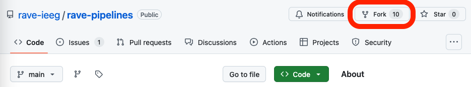
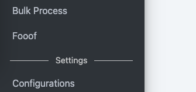
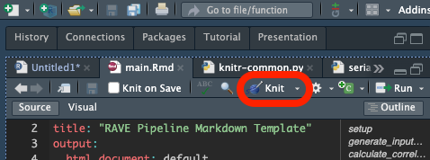

::: {.alert .alert-warning role="alert"}
Please make sure you [install RAVE and RStudio](/posts/installation/installation.html) first. This tutorial needs Python to be configured for RAVE. Please make sure you run this one-time setup command if you haven't done so `ravemanager::configure_python()`.
:::

# Part 1: Fork and open the official RAVE pipeline repository

It is highly recommended that a Github account is obtained for this tutorial, especially if the plan is to publish customized modules or collaborate with others. For those who wish to making their modules available to all RAVE users by default, a Github account is a must.

Once a Github account is obtained (otherwise jump to the next paragraph), go to https://github.com/rave-ieeg/rave-pipelines , click on __<i class="fa-solid fa-code-fork"></i> Fork__ button on the top-right of the navigation bar. Please do not change anything, simply click on __Create a fork__ button, and Github will create a copy of the pipeline module repository under a private account. From now on everything should be operated on this "forked" repository.



Under the repository, click on __<i class="fa-solid fa-code"></i> Code__ button, choose __Local__ > __Clone__ > __Https__, copy the web URL, which should follow the format `https://github.com/<your username>/rave-pipelines.git`.

Open __RStudio__, go to navigation bar (on the top of the application), click and choose __File__ > __New Project...__ > __Version Control__ > __Git__, and paste the repository URL. Make sure choosing a proper parent folder. A `rave-pipelines` folder will be created as a sub-directory of the parent folder.


Now click on __Create Project__ button in the wizard, __RStudio__ will automatically download the RAVE pipeline repository and switch its working directory to the repository directory.

## 1.1 Open the "rave-pipelines" project

It is important that __RStudio__ works at `rave-pipelines` project level. This can be verified by checking the up-right corner of the __RStudio__ label. If the active project is not `rave-pipelines`, simply click on the project drop-down icon and choose "__rave-pipelines__" to activate.


## 1.2 Test/Debug RAVE modules

Open project `rave-pipelines` in __RStudio__, type in R command 

```r
ravedash::debug_modules()
```

A dashboard system will launch in the background, allowing interactive UI debugging. 

RAVE provides mechanisms to separate the code logistics and UI (user-interface) components. A comprehensive analysis should execute with or without user-interface. In the following context, we refer "__pipeline__" to the code/script part, where the end-users can run the code offline (without UI), and "__UI__" to the user-interface part. A RAVE module often consists of a non-interactive pipeline (code) and an interactive UI.

# Part 2: Create, edit, run a Python pipeline

In this part, we will demonstrate a real example, and create a RAVE module that applies the [`fooof` algorithm](https://fooof-tools.github.io/fooof/), which is written in Python, to analyze the voltage periodograms.

We will start with the pipeline (code) part. At the end of this part, a python module should be ready to run by RAVE end-users. The Part 3 will discuss about building UI around the pipeline.

## 2.1 Create a new Python module

Open project `rave-pipelines`, type the following R command in the console:

```r
raveio::module_add(
  module_id = "fooof_module", 
  module_label = "Fooof", 
  type = "python"
)
```

A folder named with module ID __fooof_module__ is created under the __modules/__ folder. If we run the debug code `ravedash::debug_modules()`, an empty "Fooof" module is available at the side-bar. If we click on the module, only a built-in loading screen will be popped up, since we haven't added anything to the module yet.



> In RAVE, each module has a distinct module ID (`fooof_module` in this case) and a human friendly label name (`Fooof`). Please make sure the module ID is unique and does not collide with others. A good convention follows `<institute>_<lab_name>_<module_id>`, such as `utmb_karaslab_freez`, or `upenn_ese25_fooof`.


Open __modules/fooof_module/__ directory, and we will see the pipeline files. The following list includes the most important files:

* `DESCRIPTION` declares title, descriptions, and authorship of the module;
* `main.Rmd` RAVE-markdown file, the entry point containing the important analysis scripts of the pipeline;
* `settings.yaml` pipeline user inputs;
* `py/` A folder containing shared Python functions that can be reused by __main.Rmd__;
* `R/` A folder containing UI code and shared R functions that can be reused by __main.Rmd__.

## 2.2 `main.Rmd` - the entry point

### 2.2.1 Anatomy of RAVE-markdown

Markdown is a type of markup language for creating formatted text using a plain-text editor. A RAVE-markdown document is a special file in markdown that allows RAVE to construct a pipeline from the code blocks.

A typical RAVE-markdown file (an example is [available here](https://github.com/rave-ieeg/rave-pipelines/blob/e94b9338acccd565d0fa790ad3dd423f6cf08397/modules/fooof_module/main.Rmd)) starts with a key-value [meta-data](https://python-markdown.github.io/extensions/meta_data/) field specifying the title and styles of the document (possibly with other optional key-values). Please change the "__title__" field accordingly.

~~~~yml
---
title: "RAVE Pipeline Markdown Template"
output:
  html_document: default
  pdf_document: default
---
~~~~

A setup block immediately follows the meta field. This block provides tools to help the developers debug this markdown by preparing proper environments, loading the input settings to the memory, and injecting utility functions for the pipeline. Please _do NOT edit nor remove_ this block.

~~~~r
```{{r setup, include = FALSE}}
# This code block sets up the engine environment
# Please do not remove me
raveio::pipeline_setup_rmd("fooof_module")
rpymat::ensure_rpymat()
```
~~~~

After setting up the document, RAVE pipeline targets kick in. In RAVE-markdown files, pipeline "target" is simply a type of code block with a set of special options, for example,

~~~~python
```{{python calculate_correlation, use_rave = TRUE, deps = c("input_data"), export = "correlation", cue = "thorough"}}
# Load numpy
import numpy as np

# Calculate correlation
correlation = np.corrcoef(input_data['x'], input_data['y'])
print(correlation)
```
~~~~

A target always starts with ` ```{{...}}`, three back ticks followed by a pair of curly brackets. The first argument inside should be the programming language (e.g. `python` in this example, or `r` for R language), followed by the block ID, and a punctuation mark `,`. The comment must be all letters and digits. No space is allowed. The target options should be placed after the first `,`. Each option is a `key=value` pair. Multiple options should be separated by `,`. Their order does not matter.

* ` ```{{python calculate_correlation, ...` suggests that this block is written in Python, and its ID is `generate_input_data`.
  * The block ID must be unique and in "snake" format, no space nor special characters are allowed. The ID helps the compiler distinguish the code blocks and may serve as a descriptive comment of the target block. RAVE will automatically break the underscores and convert the comment to sentence case. For example, the above block ID will be interpreted as "Calculate correlation".
* `use_rave=TRUE`: (mandatory, logical `TRUE` or `FALSE`) if `TRUE`, this code block will be interpreted as a pipeline target, otherwise the block will be treated as a debugging/visualization block and will be ignored when compiling the RAVE-markdown.
* `export="input_data"`: (mandatory, string) the pipeline target is expected to generate an intermediate variable called `input_data` within the block. This variable must be created during evaluation. Notice all other local variables will be discarded at the end of evaluation.
* `deps=c("input_data", ...)`: (optional, vector of strings) a collection of previous targets whose code should execute prior to evaluating the current block. The the example, calculating `"correlation"` requires RAVE to check and run a previous target `input_data` first, and this behavior can be expected by setting `deps=c("input_data")`.
* `cue="thorough"`: controls the cache. RAVE tries to cache the values of the pipeline targets during evaluation. For the target objects that have been cached, their corresponding script might not need to be re-evaluated if all the depending values remain unchanged. For example, if the value of input `x` and `y` remain unchanged, then their correlation does not need to be re-calculated. RAVE checks and tries to reuse the cached targets with option `"thorough"`. Other choices are `"always"` (ignore cache and always run the code) and `"never"` (if cache exists, never update).


At the end of the document, there are two special blocks that are _not_ pipeline targets. The first block helps RAVE extract the code blocks and interpret `main.Rmd` into a low-level make file, which will be analyzed and loaded by RAVE. (Similar to compiling languages). Please _do NOT edit nor remove_ this block.

~~~~r
```{{r build, echo=FALSE, results='hide'}}
# Please do not edit me
build_pipeline(make_file = "make-fooof_module.R")
```
~~~~

The last block analyzes and visualizes the pipeline target dependency graph. 

~~~~r
```{{r visualize, echo=FALSE}}
# Fixed usage, show pipeline graph
try({
  asNamespace("raveio")$pipeline_dependency_graph(
    pipeline_path = ".", glimpse = TRUE)
}, silent = TRUE)
```
~~~~


### 2.2.2 Compile and run a RAVE pipeline

Please copy the following [toy example RAVE-markdown script](https://github.com/rave-ieeg/rave-pipelines/blob/e94b9338acccd565d0fa790ad3dd423f6cf08397/modules/fooof_module/main.Rmd) to your own `main.Rmd`. This example consists of two targets:

1. randomly generate two sequences of data samples; store them into a variable `input_data`
2. compute the correlation of these two samples; store them into `correlation`

To compile the RAVE-markdown file, click on the `knit` button right above the RStudio editor. RAVE will turn __main.Rmd__ into an HTML website.



Once a RAVE-markdown is compiled, the pipeline can be loaded via the `raveio` package:


``` r
pipeline <- raveio::pipeline(
  pipeline_name = "fooof_module",
  paths = file.path(rstudioapi::getActiveProject(), "modules"), 
  temporary = TRUE
)
```

Users may use variable `pipeline` to inspect, execute, and debug the pipeline:

``` r
# Inspect runnable pipeline targets

pipeline$target_table
#>           Names           Description
#> 1 settings_path   Check settings file
#> 2      settings         Load settings
#> ...
#> 6    input_data   Generate input data
#> 7   correlation Calculate correlation

# Execute the pipeline and obtain the `correlation`. RAVE analyzes the
# dependency graph and only execute the code needed to get the results

pipeline$run("correlation")
#> ▶ dispatched target input_data
#> ● completed target input_data
#> ▶ dispatched target correlation
#> ● completed target correlation
#> ▶ ended pipeline
#> Unserializing [correlation] using Python module [fooof_module]
#> array([[ 1.        , -0.00115628],
#>        [-0.00115628,  1.        ]])
```

The results can be read via R command `pipeline$read`:

``` r
correlation <- pipeline$read("correlation")
print(correlation)
#> Unserializing [correlation] using Python module [fooof_module]
#> array([[ 1.        , -0.00115628],
#>        [-0.00115628,  1.        ]])

# convert to R object
rpymat::py_to_r(correlation)
#>              [,1]         [,2]
#> [1,]  1.000000000 -0.001156276
#> [2,] -0.001156276  1.000000000
```

The intermediate target objects can also be obtained via `pipeline$read`. Since `input_data` is needed to generate `correlation`, we can query the `input_data`:

``` r
rpymat::py_to_r(pipeline$read("input_data"))
#> Unserializing [input_data] using Python module [fooof_module]
#> $x
#>   [1]  0.295724397  0.564604875  0.148322479 -0.601025450
#>   [5] -1.231688320  0.806052141 -0.530310763 -1.005618898
#>   ...
#> $y
#>   [1]  0.419751857 -0.049027138  0.370873782 -0.447514917
#>   [5]  1.072258166  1.449203206  0.702124070  0.504838715
#>   ...
```


## 2.3 `settings.yaml` - user inputs 

RAVE analysis pipelines allow users to set their own inputs, such as project and subject from which the data should be loaded, frequency ranges where analyses should be applied, or t-value thresholds that select significant channels, etc. These configurable settings are stored at file `settings.yaml`, a human-readable data serialization "YAML" file. 

During the code evaluation, RAVE will read in all the key-value pairs from `settings.yaml` and make them available to the targets in both R and Python environments. The key will be the variable name and the value will be the variable value.

To understand how RAVE handles the user input files, let's [use this example](https://github.com/rave-ieeg/rave-pipelines/blob/877f41017801682c9d5e38d202cc9da183c5f113/modules/fooof_module/settings.yaml) that contains two user inputs: `sample_size` and `random_generator`. In the previous "main.Rmd", the number of random variables `"10"` and random number generator are hard-coded. We hope that the sample size can be controlled by users via input `sample_size`, and the generator function be controlled by `random_generator`. Here is the implementation ([the full version is available here](https://github.com/rave-ieeg/rave-pipelines/blob/877f41017801682c9d5e38d202cc9da183c5f113/modules/fooof_module/main.Rmd)):


~~~~python

<!-- Begin: pipeline code -->

Generate some random data

```{{python generate_input_data, use_rave = TRUE, deps = c("sample_size", "random_generator"), export = "input_data"}}
import numpy as np

# sample size as integer
sample_s = int(sample_size)

if sample_size <= 0:
  raise Exception(f"Sample size should be positive")

# get random number generator
if random_generator == "randn":
  generator = np.random.randn
elif random_generator == "randint":
  generator = np.random.randint
elif random_generator == "rand":
  generator = np.random.rand
else:
  raise Exception(f"Unknown random number generator { generator_name }")

input_data = {
  'x' : generator(sample_size),
  'y' : generator(sample_size)
}
```

Calculate the correlation coefficients

```{{python calculate_correlation, use_rave = TRUE, deps = "input_data", export = "correlation"}}
import numpy as np
correlation = np.corrcoef(input_data['x'], input_data['y'])
print(correlation)
```

<!-- End: pipeline code -->

~~~~


Pipeline target `input_data` now depends on `sample_size` and `random_generator`. When evaluating `input_data`, these two inputs will be made available. Here is the dependency graph:


If we compile and execute the pipeline, we see:

``` r
pipeline$run("correlation")
#> ▶ dispatched target settings_path                        <- get settings path
#> ● completed target settings_path [0 seconds, 43 bytes]
#> ▶ dispatched target settings                             <- read in settings.yaml
#> ● completed target settings [0.001 seconds, 118 bytes]
#> ▶ dispatched target sample_size                          <- dispatch sample_size
#> ▶ dispatched target random_generator                     <- dispatch random_generator in parallel
#> ● completed target sample_size [0 seconds, 49 bytes]
#> ● completed target random_generator [0 seconds, 58 bytes]
#> Serializing [input_data] using Python module [fooof_module]
#> shared/user/input_data                                   <- try to find cache
#> ▶ dispatched target input_data                           <- no cache found, evaluating input_data
#> ● completed target input_data [0.686 seconds, 115 bytes]
#> Serializing [correlation] using Python module [fooof_module]
#> shared/user/correlation                                  <- try to find cache
#> ▶ dispatched target correlation                          <- no cache found, calculating correlation
#> ● completed target correlation [0 seconds, 115 bytes]
#> ▶ ended pipeline [0.886 seconds]
#> Unserializing [correlation] using Python module [fooof_module]
#> array([[ 1.        , -0.04835359],                       <- print final results
#>        [-0.04835359,  1.        ]])
```

### 2.3.1 Programmatically set pipeline inputs

<small> We will discuss advanced usages in the future. This section only covers a basic usage. </small>

Pipeline settings can be read/written programmatically in R:

``` r
pipeline <- raveio::pipeline(
  pipeline_name = "fooof_module",
  paths = file.path(rstudioapi::getActiveProject(), "modules"), 
  temporary = TRUE
)

# get settings
pipeline$get_settings()
#> $random_generator
#> [1] "randn"
#> 
#> $sample_size
#> [1] 100

# set input(s)
pipeline$set_settings(
  sample_size = 200
)

# get a specific setting
pipeline$get_settings("sample_size")
#> [1] 200
```


## 2.4 Scope/enclosure of target scripts

A RAVE pipeline target consists of inputs, an output, and script. To make an analysis pipeline __reproducible__, there are two rules:

* For any target "A", the inputs should be sufficient to generate its outputs
* For any other target "B", the only reliable object from "A" is its output (or "export"). All the intermediate/temporary variables will be discarded once the life-cycle of "A" ends.  

To understand the scope/enclosure of the RAVE pipeline targets, let's take a look at a real-world example. Imagine drinking a bottle of water. We know that the water comes from some reservoir, and it was cleaned by some factory. However, the chemicals used by water cleaning facilities are unavailable to most ordinary people. If we abstract this example into a RAVE target, then the components are:

* Inputs: water from reservoir
* Output: a bottle of clean water
* Script: water cleaning factory
  * Temporary local variables: chemicals used to clean the water

For us who only care about drinking water, the output "a bottle of clean water" is enough, and chemicals used to clean the water is inaccessible.

Now let's make such list for the pipeline targets in Section 2.3, the components of target `input_data` are:

* Inputs: `sample_size`, `random_generator` (read-only)
* Output: `input_data`
* Script: code to generate `input_data`
  * Temporary local variables: `np`, `sample_size`, `generator`

For all other targets (e.g. target `correlation`), only the `input_data` is made available, all the intermediate variables, including any changes made to these variables (e.g. `sample_size`) will be hidden/reverted.

One might argue that shared functions/modules such as `numpy` are read-only. They should be available to all targets. It would be stupid to import the same module in every target block. RAVE has a solution to this problem. We will discuss about reusing scripts to avoid "repeating ourselves" in the following section. 

## 2.5 Shared scripts - Do not repeat yourself

In Section 2.3, both targets share the same line:

``` py
import numpy as np
```

This could be annoying: do we need to repeat ourselves every time? Luckily RAVE offers a mechanism to avoid repeating ourselves for both R and Python scripts. We mainly focus on the Python part in this tutorial.


### 2.5.1 `py/` share Python functions/modules across targets

Open `modules/fooof_module/py`, we will see the following files:

* `fooof_module/` a customized python module folder to include shared functions
* `knitr-common.py` entry-point; the script will be evaluated at the beginning of each pipeline target block.
* `rave-py-submodule.yaml` python requirement, which helps RAVE install 3rd-party "pip" or "conda" packages.

Let's implement a very simple logging feature using the Python `loguru` package. Notice this is not the most efficient implementation because we want to demonstrate the full functionality.

Step 1: Install `loguru` package for development use (one-time setup)

Run R command

``` r
rpymat::add_packages("loguru")
```

Step 2: add `loguru` to `rave-py-submodule.yaml` so the RAVE will automatically install the package when users download the module.

~~~~yaml
name: fooof_module
dependencies:
- pip:
  - numpy
- conda:
  - loguru
~~~~


Step 3: create a `logger.py` at `modules/fooof_module/py/fooof_module/`, copy-paste the following script. Again, we don't have to do this in the actual development, the goal is to demonstrate how a custom function can be shared across the targets.

``` py
from loguru import logger

def log_info(*args, **kwargs):
    logger.info(*args, **kwargs)
```


Step 4: Create shared initialization script. Open `modules/fooof_module/py/knitr-common.py`, append these lines. For each Python target, the module `numpy` will be available as `np`, and custom function `log_info` will be available too. 

```py
import numpy as np
from fooof_module.logger import log_info
```

If we take a glimpse of the [compiled target file](https://github.com/rave-ieeg/rave-pipelines/blob/bfaaf4219d7ab1e607247b68842c1287d825d3e1/modules/fooof_module/py/fooof_module/rave_pipeline_adapters/pipeline_target_correlation.py), we will see that these two lines are added on top.


Step 5: Go to `main.Rmd`, remove the `numpy` import line. Now we can use `np` and `log_info` without explicitly importing these two variables in every block. See [this final result](https://github.com/rave-ieeg/rave-pipelines/blob/bfaaf4219d7ab1e607247b68842c1287d825d3e1/modules/fooof_module/main.Rmd)

Step 6: Compile (knit) `main.Rmd`

We can test-run the pipeline:

``` r
pipeline <- raveio::pipeline(
  pipeline_name = "fooof_module",
  paths = file.path(rstudioapi::getActiveProject(), "modules"), 
  temporary = TRUE
)

pipeline$run("correlation")
#> ... (output omitted)
#> 2025-02-28 17:36:03.792 | INFO     | fooof_module.logger:log_info:4 - Generating sample data with function np.random.randn and sample size 200
#> ... (output omitted)
#> 2025-02-28 17:36:03.803 | INFO     | fooof_module.logger:log_info:4 - Calculating correlation: 
#>  [[ 1.         -0.00115628]
#>  [-0.00115628  1.        ]]
#> ... (output omitted)
```

From the output we can see that the `log_info` is working properly.

The full git change log is [here](https://github.com/rave-ieeg/rave-pipelines/commit/bfaaf4219d7ab1e607247b68842c1287d825d3e1):

* [modules/fooof_module/py/rave-py-submodule.yaml](https://github.com/rave-ieeg/rave-pipelines/blob/bfaaf4219d7ab1e607247b68842c1287d825d3e1/modules/fooof_module/py/rave-py-submodule.yaml)
* [modules/fooof_module/py/knitr-common.py](https://github.com/rave-ieeg/rave-pipelines/blob/bfaaf4219d7ab1e607247b68842c1287d825d3e1/modules/fooof_module/py/knitr-common.py)
* [modules/fooof_module/py/fooof_module/logger.py](https://github.com/rave-ieeg/rave-pipelines/blob/bfaaf4219d7ab1e607247b68842c1287d825d3e1/modules/fooof_module/py/fooof_module/logger.py)


## Part 3: Implement `fooof` pipeline

(TBD)
