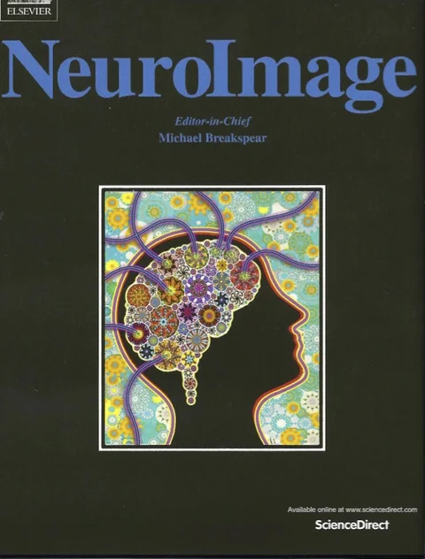

#### Links & Images

If you want to include your own figures, please upload figures from Github. Make sure the figure is at the same directory as the markdown file.

+---------------------------------------------------------------------------+---------------------------------------------------------------------------+
| Markdown Syntax                                                           | Output                                                                    |
+===========================================================================+===========================================================================+
| ``` markdown                                                              | <https://rave.wiki>                                                       |
| <https://rave.wiki>                                                       |                                                                           |
| ```                                                                       |                                                                           |
|                                                                           |                                                                           |
| link                                                                      |                                                                           |
+---------------------------------------------------------------------------+---------------------------------------------------------------------------+
| ``` markdown                                                              | [RAVE Website](https://rave.wiki)                                         |
| [RAVE Website](https://rave.wiki)                                         |                                                                           |
| ```                                                                       |                                                                           |
|                                                                           |                                                                           |
| link with different text                                                  |                                                                           |
+---------------------------------------------------------------------------+---------------------------------------------------------------------------+
| ``` markdown                                                              |                                           |
|                                           |                                                                           |
| ```                                                                       |                                                                           |
|                                                                           |                                                                           |
| image                                                                     |                                                                           |
+---------------------------------------------------------------------------+---------------------------------------------------------------------------+
| ``` markdown                                                              | {width="30%"}                             |
| {width="30%"}                             |                                                                           |
| ```                                                                       |                                                                           |
|                                                                           |                                                                           |
| image with 30% width                                                      |                                                                           |
+---------------------------------------------------------------------------+---------------------------------------------------------------------------+
| ``` markdown                                                              | [{width="30%"}](https://rave.wiki)        |
| [{width="30%"}](https://rave.wiki)        |                                                                           |
| ```                                                                       |                                                                           |
|                                                                           |                                                                           |
| image with link                                                           |                                                                           |
+---------------------------------------------------------------------------+---------------------------------------------------------------------------+
| ``` markdown                                                              | [{width="30%"}](https://rave.wiki) |
| [{width="30%"}](https://rave.wiki) |                                                                           |
| ```                                                                       |                                                                           |
|                                                                           |                                                                           |
| image with link and tooltip (hover text)                                  |                                                                           |
+---------------------------------------------------------------------------+---------------------------------------------------------------------------+
| ``` markdown                                                              | [{width="30%" fig-alt="ss"}](https://rave.wiki)    |
| [{width="30%" fig-alt="ss"}](https://rave.wiki)    |                                                                           |
| ```                                                                       |                                                                           |
|                                                                           |                                                                           |
| image with link: alt-text when image is missing                           |                                                                           |
+---------------------------------------------------------------------------+---------------------------------------------------------------------------+

#### Videos

You can include videos in documents using the `{}` shortcode. For example, here we embed a YouTube video:

``` {.markdown shortcodes="false"}

```

Videos can refer to video files (e.g. MPEG) or can be links to videos published on YouTube, Vimeo, or Brightcove. Learn more in the article on [Videos](https://quarto.org/docs/authoring/videos.html).
