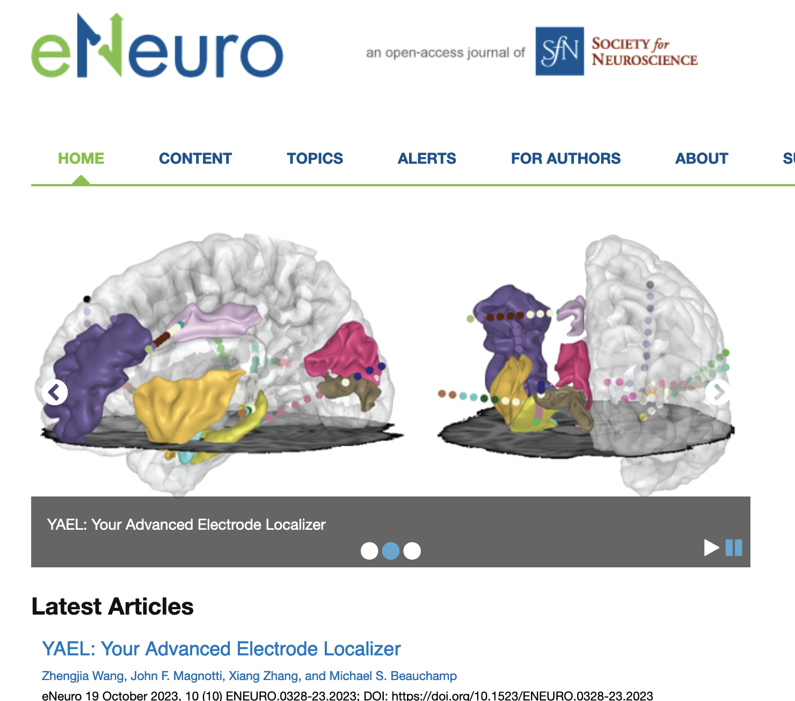

## Overview

{.hidden}

Electrode localization is a critical step for getting spatial information of iEEG and DBS electrodes. YAEL (*Your Advanced Electrode Localizer*) provides a fully integrated pipeline that takes in raw DICOM or NIfTI images and outputs the electrode coordinates and atlas labels. The pipeline is divided into two parts:

-   Input: T1 pre-operative MRI and post-surgery CT

-   Step 1: Imaging preprocess

-   Step 2: Interactive 3D electrode localization

-   Output: electrode coordinate table and RAVE 3D viewer

For more high-level information, [please check our paper](https://doi.org/10.1523/ENEURO.0328-23.2023). Click on the 'Prerequisites' button to check data and system requirements:

::: {.rave-modal data-type="botton" data-class="btn btn-primary" data-label="Prerequisites" data-title="Prerequisites"}
#### 1. Data

The full pipeline requires T1 MRI (pre-op) and CT (post-op) with electrodes implanted. YAEL supports either DICOM or NIfTI imaging formats.

#### 2. RAVE-Py environment

Some methods such as `ANTs` for CT-MR co-registration are developed in Python. We highly recommend that you run the following R command:

``` r
ravemanager::validate_python()
#> Initializing python environment: 
...
#>  ants: 0.5.3
```

If you see output `ants:` followed by a valid version number, that means `ANTs` is properly configured, otherwise run the following command to configure. RAVE will create an isolated `Python` environment that will not affect your current system.

``` r
ravemanager::configure_python()
```

Please make sure the computer has access to the internet.

#### 3. FreeSurfer

`FreeSurfer` is highly recommended if you want to reconstruct brain surface models. The program also comes with commonly used brain parcelation and sub-cortical segmentation methods. Please check their official website on how to download and configure. Make sure you also register and download a license file (it's free):

-   Download page: <https://surfer.nmr.mgh.harvard.edu/fswiki/DownloadAndInstall>
-   Free license application: <https://surfer.nmr.mgh.harvard.edu/registration.html>

If you are using Windows, please consider using docker <https://hub.docker.com/r/freesurfer/freesurfer> to run FreeSurfer reconstruction on your own. See (TBD) for how to bring your own FreeSurfer folder to YAEL.
:::

## Step 1: Imaging Preprocess

The imaging preprocess module in YAEL contains the following two parts. If you would like to substitute any part (or even the entire module) with your existing pipelines, see 'Alternative Preprocess' (TBD) below.

-   T1 image preprocess
-   CT-MR co-registration

Here is a video tutorial using NIfTI T1 and CT as input:



<!--  DICOM images -->

<!-- To start, go to the RAVE 'raw directory' (the default location is under the home directory > `rave_data` > `raw_dir`), create a subject folder named by the subject code.  -->

<!-- {.alert .alert-info role="info"} -->

<!-- The default RAVE 'raw directory' is under the user home directory > `rave_data` > `raw_dir`. You can always use R command `raveio::raveio_getopt("raw_data_dir")` to obtain the full path to the raw directory. -->

<!-- When a patient is being enrolled to an experiment, normally this patient will be given a code to avoid their personal information being exposed to the public. For example, a patient is given a subject code `"DBNLP001"`. To create the preprocessing folder for this subject,  -->

<!-- to create a subject code `` -->

<!-- to create a subject with code `DBNLP001` under the default settings, the following file path should be created: -->

<!-- ``` -->

<!-- ~/rave_data/raw_dir/DBNLP001 -->

<!-- ``` -->

<!-- -->

## Step 2: Interactive 3D electrode localization

(This section needs to be polished. The video is slightly outdated)

Here is an introductory video of using YAEL interactive 3D viewer for electrode localization.



More videos are available here:

-   ::: {.rave-modal data-type="span" data-class="text-decoration-underline" data-label="Training video for localizing segmented DBS electrodes" data-title="Localize DBS electrodes"}
    ::: {.alert .alert-info}
    The steps to localize a DBS lead contains 3 steps:

    1.  Register the first (inner-most) electrode contact
    2.  Register the lead direction (anywhere along the probe)
    3.  Use keyboard shortcut (`4` or `shift+4`) to rotate the electrode so the guided arrow aligns with CT artifacts.
    :::

    
    :::

-   ::: {.rave-modal data-type="span" data-class="text-decoration-underline" data-label="Tutorials made by Neurocognition of Language Lab" data-title="Tutorial made by Neurocognition of Language Lab"}
    Credit: Sarah (Ivi) Fung
      
    :::
