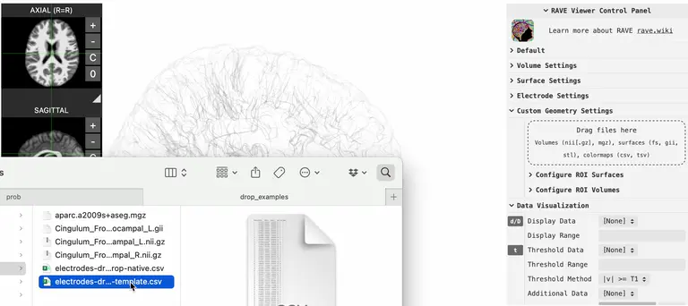
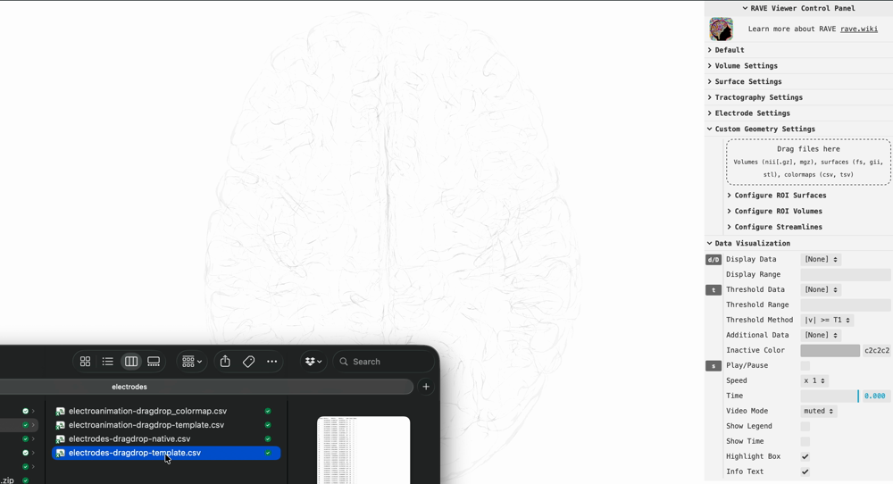

## Instructions

- [Download the MNI152 viewer here](../../data/viewers/RAVE_dragdrop_sample.zip){target="_blank"}
- Unzip the file, open file `RAVE_MNI_template.html`, a MNI152 template viewer

### 1. Drag & drop electrode coordinates

{width="100%"}

Prepare a CSV file containing electrode coordinates and drop it into the viewer as shown above. An example file `electrodes/electrodes-dragdrop-template.csv` is included in the downloaded zip.

The CSV must contain the following columns (column names are **case-sensitive**):

| Electrode | MNI152_x | MNI152_y | MNI152_z | Label |
|----------:|---------:|---------:|---------:|:------|
|         1 |   -28.23 |    15.38 |   -39.43 | LI1   |
|         2 |   -33.50 |    16.10 |   -36.69 | LI2   |
|       ... |      ... |      ... |      ... | ...   |

- `Electrode` *(required)*: integer electrode channel number
- `MNI152_x`, `MNI152_y`, `MNI152_z` *(required)*: electrode position in MNI152 space (mm)
- `Label` *(required)*: text label displayed next to the electrode sphere
- `Group` *(optional)*: group name; electrodes sharing the same group are rendered in the same color
- `Radius` *(optional)*: sphere radius in mm (default: `1`)

After dropping the file the electrodes appear in the viewer. To remove them, expand the control panel \> `Electrode Settings` \> `Clear Uploaded Electrodes`.

::: callout-note
For a **native-subject** viewer, replace `MNI152_x / MNI152_y / MNI152_z` with `T1R / T1A / T1S` (subject-native coordinates). All other columns remain the same. An example is provided in `electrodes/electrodes-dragdrop-native.csv`.
:::

### 2. Set electrode values

{width="100%"}

Once electrodes are visible in the viewer you can color them by any numeric or categorical variable. Prepare a second CSV — an example is provided in `electrodes/electroanimation-dragdrop-template.csv` — and drop it into the viewer.

The value CSV must contain at least an `Electrode` column plus one or more value columns:

| Electrode | Power | Cluster |
|----------:|------:|:--------|
|         1 |  1.92 | A       |
|         2 |  0.98 | B       |
|       ... |   ... | ...     |

- `Electrode` *(required)*: must match the channel numbers in the coordinate file
- `Time` *(optional)*: numeric time-point in seconds; when present the viewer animates the values over time
- **Value columns** *(at least one required)*: any name you choose (e.g. `Power`, `Cluster`, `BetaBand`)
  - **Numerical** values are displayed on a continuous color scale
  - **Categorical** values must be non-numeric strings (use `"A"`, `"B"`, `"C"` rather than `1`, `2`, `3`)

After dropping the file, expand the control panel \> `Electrode Settings` \> `Display Data`, or use the keyboard shortcut `D` to select which variable to display.

### 3. Customize the color map

{width="100%"}

::: callout-note
Complete steps 1 and 2 before attempting this step.
:::

To override the default colors, create a **colormap CSV** whose file name is the value CSV name with `_colormap` appended before the `.csv` extension — for example if the value file is `my_values.csv`, name the colormap file `my_values_colormap.csv`.

- **Column names** must match the value column names from the value CSV (e.g. `Power`, `Cluster`)
- **Each row** contains one key color (hex code such as `#2166ac`, or an HTML color name such as `red`) per column

| Power     | Cluster |
|:----------|:--------|
| aliceblue | #e41a1c |
| #f7f7f7   | #377eb8 |
| purple    | #4daf4a |
|           | #7d7f4a |

- For **continuous** variables the listed colors are treated as key stops and automatically interpolated across the full value range
- For **categorical** variables each row corresponds to one category in **alphabetical order** (first row → first category, second row → second category, …); unused rows are ignored

Drop the colormap CSV into the viewer the same way as the value CSV. The electrode colors update immediately.
