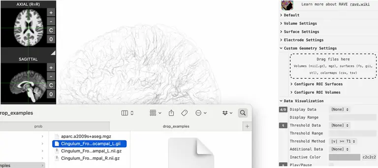

{width="100%"}

* [Download the MNI152 viewer here](../../data/viewers/RAVE_MNI_template.html)
* [Download the GIfTI surface here](Cingulum_Frontal_Parahippocampal_L.gii)

### Instructions

* To visualize your own surface files (FreeSurfer, GIfTI) in the 3D viewer, drop the surface file as the animation
* You may change the color by expanding control panel \> `Custom Geometry Settings` \> `Configure ROI Surfaces` \> "your_surface_filename" \> `Color`
* To clear the object, open `Configure ROI Surfaces` \> `Clear Uploaded Surfaces`
