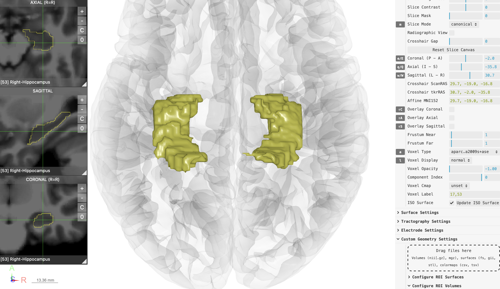

## Instructions

- [Download the MNI152 viewer here](../../data/viewers/RAVE_dragdrop_sample.zip){target="_blank"}
- Unzip the file, open file `RAVE_MNI_template.html`, a MNI152 template viewer

### Example 1: continuous volume

{width="100%"}

- Drop the file `volumes/Cingulum_Frontal_Parahippocampal_L.nii.gz` folder (or any volume of your choice in `.nii.gz`, `.mgz` formats) as demonstrated in the animation above
- The volume will show up in the viewer.
  - If the color is not continuous, you may change the color mode by expanding control panel \> `Custom Geometry Settings` \> `Configure ROI Volumes` \> `Cingulum_Frontal_Parahippocampal_L` \> `Color Mode`, choose **"continuous"**
  - To filter the volume, expand the control panel \> `Volume Settings` \> `Voxel Type`, choose the **Cingulum_Frontal_Parahippocampal_L.nii.gz**. You can change the color-map via `Voxel Cmap`, threshold the values via `Voxel Min` (lower bound) and `Voxel Max` (upper bound)
  - If this is an fMRI image, `Volume Settings` \> `Component Index` allows you to set the time index
- To clear the object, open `Configure ROI Volumes` \> `Clear Uploaded Volumes`

### Example 1: discrete volume (atlases/mask)

{width="100%"}

- Drop the file `volumes/aparc.a2009s+aseg.mgz` folder as demonstrated in the animation above
- The atlas will show up in the viewer.
  - If the color is not discrete, you may change the color mode by expanding control panel \> `Custom Geometry Settings` \> `Configure ROI Volumes` \> `aparc.a2009s_aseg` \> `Color Mode`, choose **"discrete"**
  - To filter the volume, expand the control panel \> `Volume Settings` \> `Voxel Type`, choose the **aparc.a2009s+aseg.mgz**. Then enter the `Voxel Label` the atlas key indices. For example, `17,53` are the left & right hippocampus
  - For FreeSurfer-generated atlases, you can find the color index labels [here](https://surfer.nmr.mgh.harvard.edu/fswiki/FsTutorial/AnatomicalROI/FreeSurferColorLUT){target="_blank"}
  - You can turn the volume into surfaces by clicking on `Volume Settings` \> `Update ISO Surface`
  - For discrete atlases/masks, set `Volume Settings` \> `Voxel Opacity` to **0** to display the border of the masks rather than obscuring the underlay MRI (see screenshot below)
- To clear the object, open `Configure ROI Volumes` \> `Clear Uploaded Volumes`

{width="100%"}
