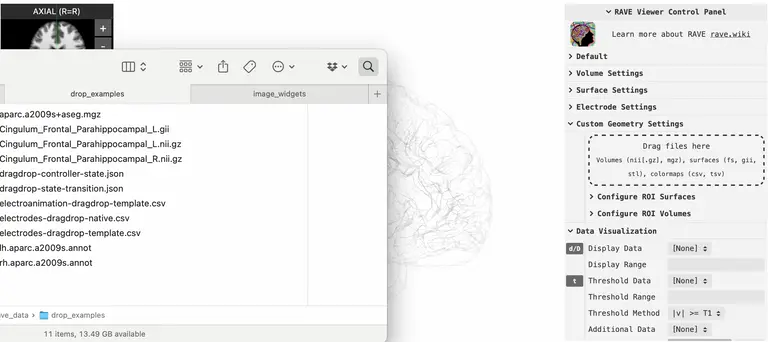
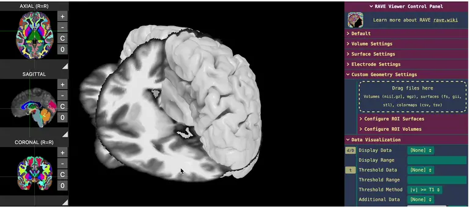

```{r, echo=FALSE, results='hide', message=FALSE, warning=FALSE, eval=TRUE}
.ensure_viewer_template("cvs_avg35_inMNI152")
dir.create("data/viewers", showWarnings = FALSE, recursive = FALSE)

template <- threeBrain::merge_brain(
  template_subject = "cvs_avg35_inMNI152",
  template_surface_types = c("pial", "inflated")
)
widget <- template$plot(
  controllers = list(
    "Left Opacity" = 0.1,
    "Right Opacity" = 0.1
  )
)

# (optional) save the widget so you can download
path <- threeBrain::save_brain(
  widget = widget,
  path = "data/viewers/RAVE_MNI_template.html",
  title = "RAVE-MNI152 Template"
)
```

```{r, eval=TRUE}
#| column: page
#| classes: "column-page-inset"
template <- threeBrain::merge_brain(
  template_subject = "cvs_avg35_inMNI152",
  template_surface_types = c("pial", "inflated")
)
template$plot(
  side_display = FALSE,
  controllers = list(
    "Left Opacity" = 0.1,
    "Right Opacity" = 0.1
  )
)
```

## How to use this demo

The 3D viewer supports dragging & dropping files for quick adhoc visualizations. Click on the links below to see different use-cases. If you would like to open the viewer locally and try it out, please [download an offline version](#){data-wasm-link="/home/web_user/RAVE_MNI_template.html"} once the viewer is ready.

- ::: {.rave-modal data-type="span" data-class="text-decoration-underline" data-label="Basic: drop in a surface mesh" data-title="Basic: drop in a surface mesh"}
  {width="100%"}

  <hr />

  [Example file for this demo](Cingulum_Frontal_Parahippocampal_L.gii)

  - Drop GIfTI (`*.gii`), STL (`*.stl`), or FreeSurfer mesh files (`*h.pial`, `*h.white`, `*h.smoothwm`, `*h.inflated`, ...)
  - To clear the object, open `Configure ROI Surfaces` \> `Clear Uploaded Surfaces`
  :::

- ::: {.rave-modal data-type="span" data-class="text-decoration-underline" data-label="Drop in surface annotation files" data-title="Drop in surface annotation files"}
  {width="100%"}

  <hr />

  Example files: [left hemisphere](lh.aparc.a2009s.annot) and [right hemisphere](rh.aparc.a2009s.annot)

  - Drop FreeSurfer annotation (`*.annot`) or curvature files (`*.curv` or `*.sulc`)
  - To clear the object, open `Configure ROI Surfaces` \> `Clear Uploaded Surfaces`
  :::

- ::: {.rave-modal data-type="span" data-class="text-decoration-underline" data-label="Drop in continuous volume" data-title="Drop in continuous volume"}
  {width="100%"}

  <hr />

  [Example file for this demo](Cingulum_Frontal_Parahippocampal_L.nii.gz)

  - Drop in a NIfTI (`*.nii`, `*.nii.gz`) or a MGZ (`*.mgz`) file
  - Clamp volume via threshold using `Clipping Min/Max`
  - Set color map to "continuous" or "single color"
  :::

- ::: {.rave-modal data-type="span" data-class="text-decoration-underline" data-label="Drop in atlas volume & make surface objects" data-title="Drop in atlas volume & make surface objects"}
  {width="100%"}

  <hr />

  [Example file for this demo](aparc.a2009s+aseg.mgz)

  - Drop in a NIfTI (`*.nii`, `*.nii.gz`) or a MGZ (`*.mgz`) file
  - Set color map to "discrete"
  - Subset and enter the atlas labels in `Volume Settings` \> `Voxel Label`
  - Generate quick surface from the labels by clicking `Update ISO Surface`
  :::

- ::: {.rave-modal data-type="span" data-class="text-decoration-underline" data-label="Drop in and visualize electrodes coordinates" data-title="Drop in and visualize electrodes coordinates"}
  {width="100%"}

  <hr />

  [Example file for this demo](electrodes-dragdrop-template.csv)

  - Prepare an electrode coordinate file (see an example from the link above). The bare minimum columns are `Electrode` (channel number), `Label` (contact label), and anatomical coordinates (see below)
    - For visualizing on template brain, please specify either column set `MNI152_x`, `MNI152_y`, `MNI152_z` (known as the MNI coordinate) or `MNI305_x`, `MNI305_y`, `MNI305_z` (known as fsaverage coordinate)
    - For visualizing on native brain, specify `T1R`, `T1A`, `T1S` (scanner RAS coordinate) or `Coord_x`, `Coord_y`, `Coord_z` (surface, or FreeSurfer tk-registered coordinate)
  :::

- ::: {.rave-modal data-type="span" data-class="text-decoration-underline" data-label="Drop in and animate electrodes" data-title="Drop in and animate electrodes"}
  {width="100%"}

  <hr />

  [Example coordinate file](electrodes-dragdrop-template.csv) & [value table](electroanimation-dragdrop-template.csv)

  - First, drop in an electrode coordinate file (see the example coordinate file above)
  - Then, drop in an electrode value table with `Electrode`, `Time`, and one or more variable columns (see the example value table above)
  - Finally, turn on `Data Visualization` \> `Play/Pause` to start animation
  - (Optional) to hide inactive electrodes, go to `Electrode Settings` \> `Visibility`, and set to "hide inactives"
  :::

- ::: {.rave-modal data-type="span" data-class="text-decoration-underline" data-label="Drop in to set viewer state" data-title="Drop in to set viewer state"}
  {width="100%"}

  <hr />

  [Example file for this demo](dragdrop-controller-state.json)

  - Go to `Default` \> `Copy Controller State`, the viewer state will be copied to the clipboard (download the example data to see what is inside)
  - You can directly copy the state string to the text box (`Default` \> `Paste to set State`) or save the string to a `json` file and drag & drop in
  :::

- ::: {.rave-modal data-type="span" data-class="text-decoration-underline" data-label="Drop in state transition file" data-title="Drop in state transition file"}
  

  <hr />

  Download [this example file](dragdrop-state-transition.json) and try out! The file is essentially a `json` file with one flag, some global parameters and settings for each transition.

  - The flag is `"isThreeBrainTransition": true`, allowing RAVE to know how to handle the file
  - Global parameters include
    - `resetCanvas`: whether to reset canvas to its default state before applying transition animation
    - `loops`: number of additional loops
    - `trasitionDuration`: duration of a transition, can be set at stage-level
    - `transitionTimeout`: total timeout for each transition before switching to the next state, can be set at stage-level
  - The transition data is an array of states:
    - `background`: the canvas background
    - `cameraMain`: contains camera `position`, `up` direction, and `zoom` level
    - Each `controllers` list sets the controller values at beginning of the transition (`immediate`), interpolated animation (`animated`), and at the end of the transition (`delayed`)
  :::
